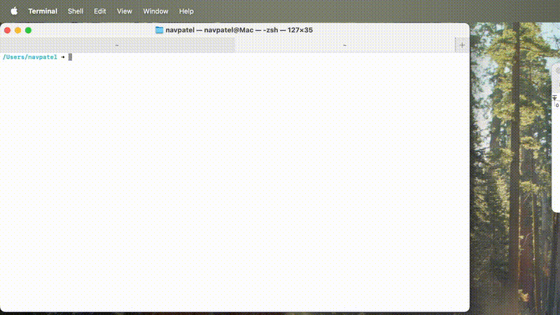

# 🎙️ ctrlSPEAK  

[](https://github.com/patelnav/homebrew-ctrlspeak)
[](https://www.python.org/downloads/)
[](https://opensource.org/licenses/MIT)

**Turn your voice into text with a triple-tap — minimal, fast, and macOS-native.**

## 🚀 Overview

**ctrlSPEAK** is your *set-it-and-forget-it* speech-to-text companion. Triple-tap `Ctrl`, speak your mind, and watch your words appear wherever your cursor blinks — effortlessly copied and pasted. Built for macOS, it's lightweight, low-overhead, and stays out of your way until you call it.



## ✨ Features

- 🖥️ **Minimal Interface**: Runs quietly in the background via the command line  
- ⚡ **Triple-Tap Magic**: Start/stop recording with a quick `Ctrl` triple-tap  
- 📋 **Auto-Paste**: Text lands right where you need it, no extra clicks  
- 🔊 **Audio Cues**: Hear when recording begins and ends  
- 🍎 **Mac Optimized**: Harnesses Apple Silicon's MPS for blazing performance  
- 🌟 **Top-Tier Models**: Powered by NVIDIA NeMo and OpenAI Whisper  

## 🛠️ Get Started

- **System**: macOS 12.3+ (MPS acceleration supported)  
- **Python**: 3.11+  
- **Permissions**:  
  - 🎤 Microphone (for recording)  
  - ⌨️ Accessibility (for shortcuts)  
*Grant these on first launch and you're good to go!*

### 📦 Installation

#### Using Homebrew (Recommended)

```bash
# Install ctrlSPEAK using Homebrew
brew tap patelnav/ctrlspeak
brew install ctrlspeak
```

For faster package installation:
```bash
# Install with UV support for faster package installation
brew install ctrlspeak --with-uv
```

#### Manual Installation

Clone the repository:
```bash
git clone https://github.com/patelnav/ctrlspeak.git
cd ctrlspeak
```

Create and activate a virtual environment:
```bash
# Create a virtual environment
python -m venv .venv

# Activate it on macOS/Linux
source .venv/bin/activate
```

Install dependencies (recommended with UV for faster installation):
```bash
# Install UV first if you don't have it
pip install uv

# Then install dependencies with UV
uv pip install -r requirements.txt

# Or use traditional pip (slower)
pip install -r requirements.txt
```

For Whisper model support (optional):
```bash
# With UV (recommended)
uv pip install -r requirements-whisper.txt

# Or with traditional pip
pip install -r requirements-whisper.txt
```

## 🧰 Entry Points

- `ctrlspeak.py`: The full-featured star of the show  
- `live_transcribe.py`: Continuous transcription for testing vibes  
- `test_transcription.py`: Debug or benchmark with ease  


### Workflow

1. Run ctrlSPEAK in a terminal window:
   ```bash
   # If installed with Homebrew
   ctrlspeak
   
   # If installed manually (from the project directory with activated venv)
   python ctrlspeak.py
   ```
2. Triple-tap Ctrl to start recording
3. Speak clearly into your microphone
4. Triple-tap Ctrl again to stop recording
5. The transcribed text will be automatically pasted at your cursor position

## Models

ctrlSPEAK uses open-source speech recognition models:

- **Parakeet** (default): NVIDIA NeMo's English-only model with high accuracy
- **Canary**: NVIDIA NeMo's multilingual model supporting English, German, French, and Spanish
- **Whisper** (optional): OpenAI's fast and accurate general-purpose speech recognition model
  - To use Whisper, install additional dependencies: `uv pip install -r requirements-whisper.txt` or `pip install -r requirements-whisper.txt`

The models are automatically downloaded from HuggingFace the first time you use them.

### Model Selection

You can specify which model to use with the `--model` flag:

```bash
# Using Homebrew installation
ctrlspeak --model parakeet  # Default
ctrlspeak --model canary    # Multilingual with punctuation
ctrlspeak --model whisper   # OpenAI's model

# Using manual installation
python ctrlspeak.py --model parakeet
python ctrlspeak.py --model canary
python ctrlspeak.py --model whisper
```

For debugging, you can use the `--debug` flag:
```bash
ctrlspeak --debug
```

## Models Tested

1. **Parakeet (NVIDIA)** - `nvidia/parakeet-tdt-1.1b`
2. **Canary (NVIDIA)** - `nvidia/canary-1b`
3. **Whisper (OpenAI)** - `openai/whisper-large-v3-turbo`

## Performance Comparison

| Model   | Load Time | Transcription Time | Transcription Quality | Output Example |
|---------|-----------|-------------------|----------------------|----------------|
| Parakeet | 14.84s    | 2.21s             | Good, without punctuation | "well i don't wish to see it any more observed phoebe turning away her eyes it is certainly very like the old portrait" |
| Canary   | 8.00s     | 25.45s            | Excellent, with punctuation | "Well, I don't wish to see it any more, observed Phoebe, turning away her eyes. It is certainly very like the old portrait." |
| Whisper  | 1.45s     | 2.23s             | Good, without punctuation | "well i don't wish to see it any more observed phoebe turning away her eyes it is certainly very like the old portrait" |

## Permissions

The app requires:
- Microphone access (for recording audio)
- Accessibility permissions (for global keyboard shortcuts)

You'll be prompted to grant these permissions on first run.

## Troubleshooting

- **No sound on recording start/stop**: Ensure your system volume is not muted
- **Keyboard shortcuts not working**: Grant accessibility permissions in System Settings
- **Transcription errors**: Try speaking more clearly or using the other model

## Credits

### Sound Effects
- Start sound: ["Notification Pluck On"](https://pixabay.com/sound-effects/notification-pluck-on-269288/) from Pixabay
- Stop sound: ["Notification Pluck Off"](https://pixabay.com/sound-effects/notification-pluck-off-269290/) from Pixabay

## License

[MIT License](LICENSE)